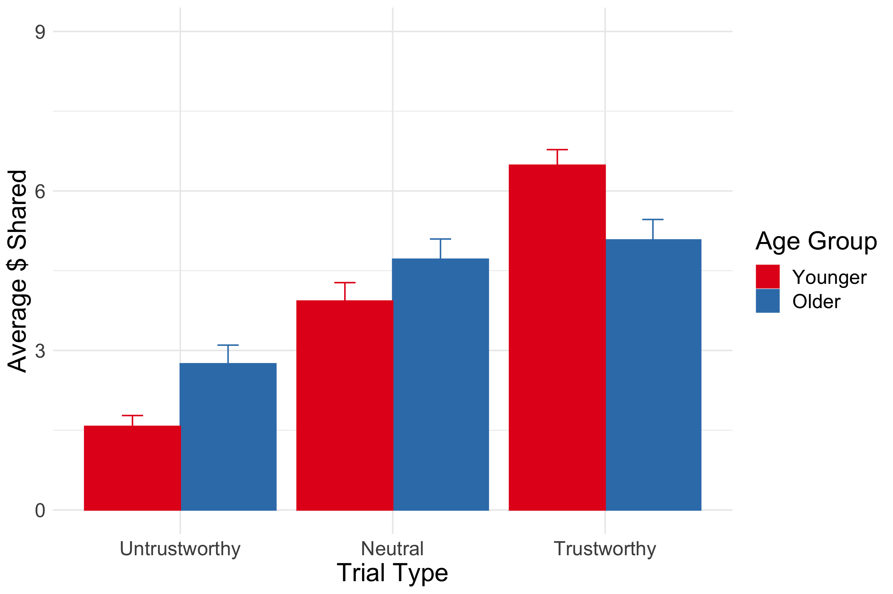
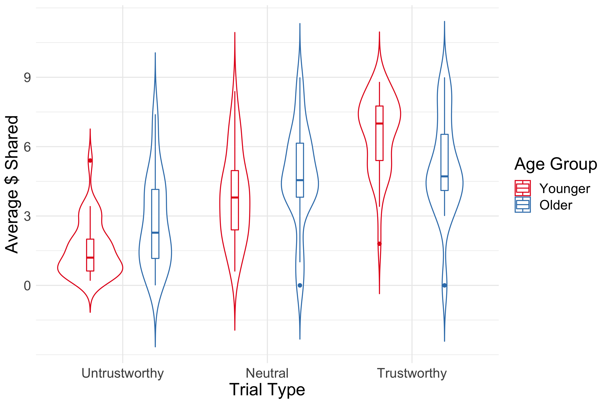
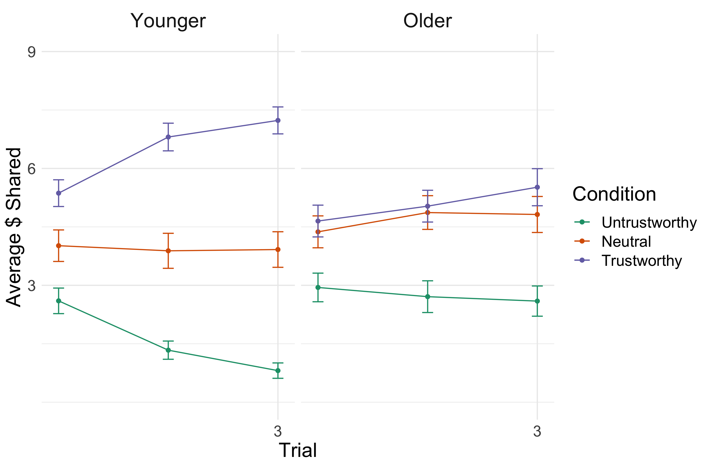

This is a quick and dirty analysis of the behavioral data collected (so far).

### Simple bar graph



### Violin plot of same data



### ANOVA
```{r, echo = FALSE, tidy = TRUE, comment = ''}
library(here)
m1 <- readRDS(here('output', 'age*tt_model.rds'))
summary(m1)
```

#### How do these evolve over time? I binned the 15 trials for each codntion into 5-trial stages and looked at how behavior changed from early to late stages.



### ANOVA 

```{r, echo = FALSE, tidy = TRUE, comment = ''}
library(here)
m2 <- readRDS(here('output', 'age*tt*stage_model.rds'))
summary(m2)
```