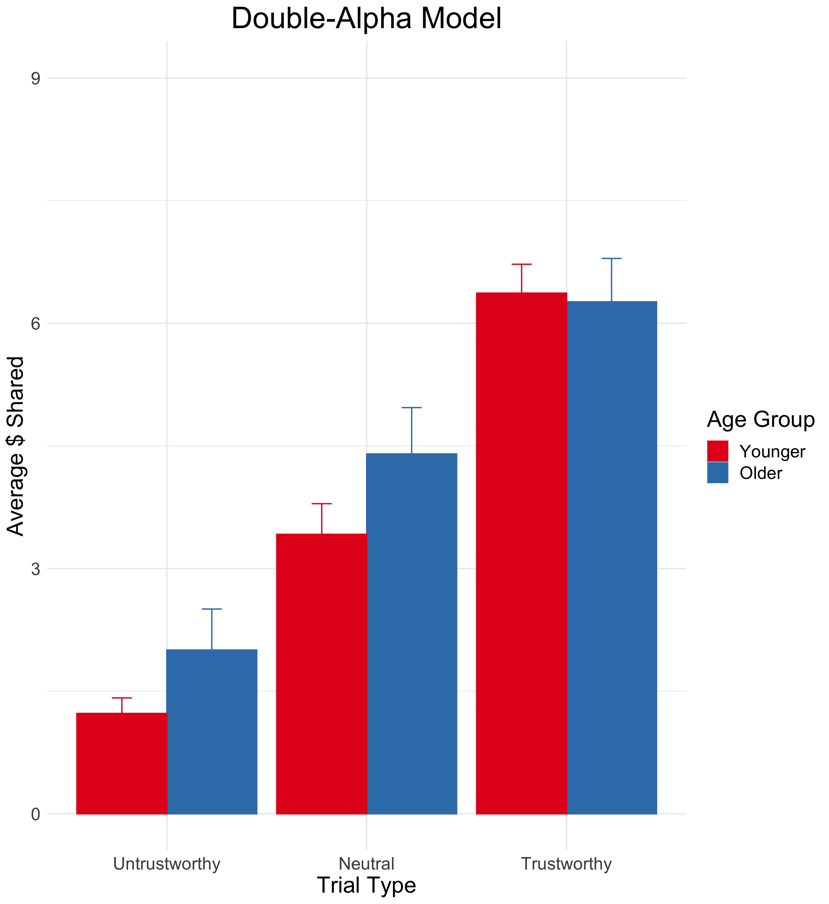
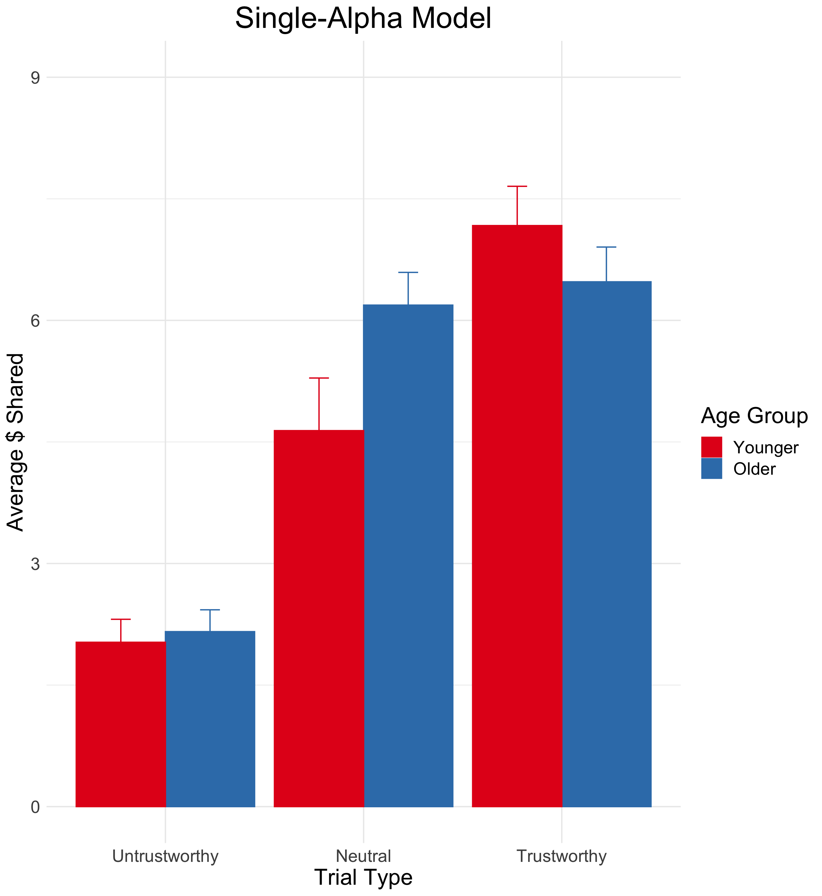
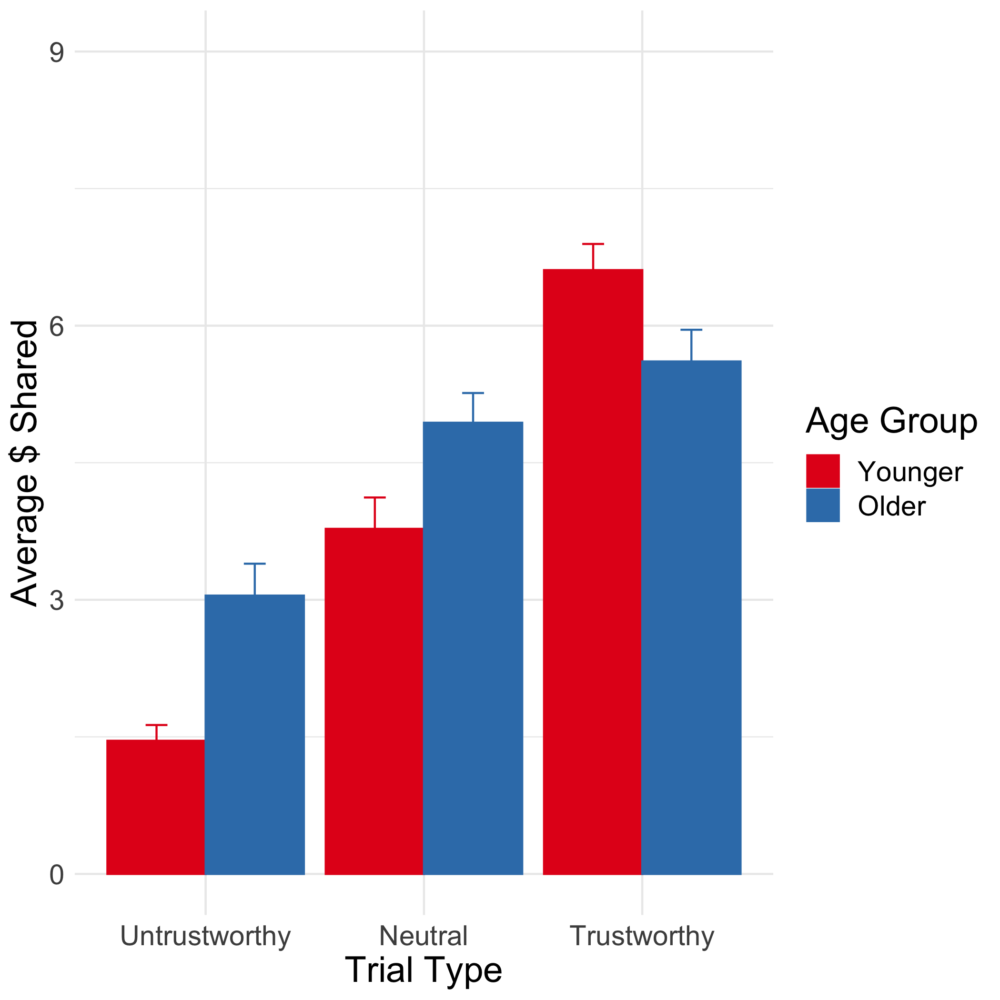
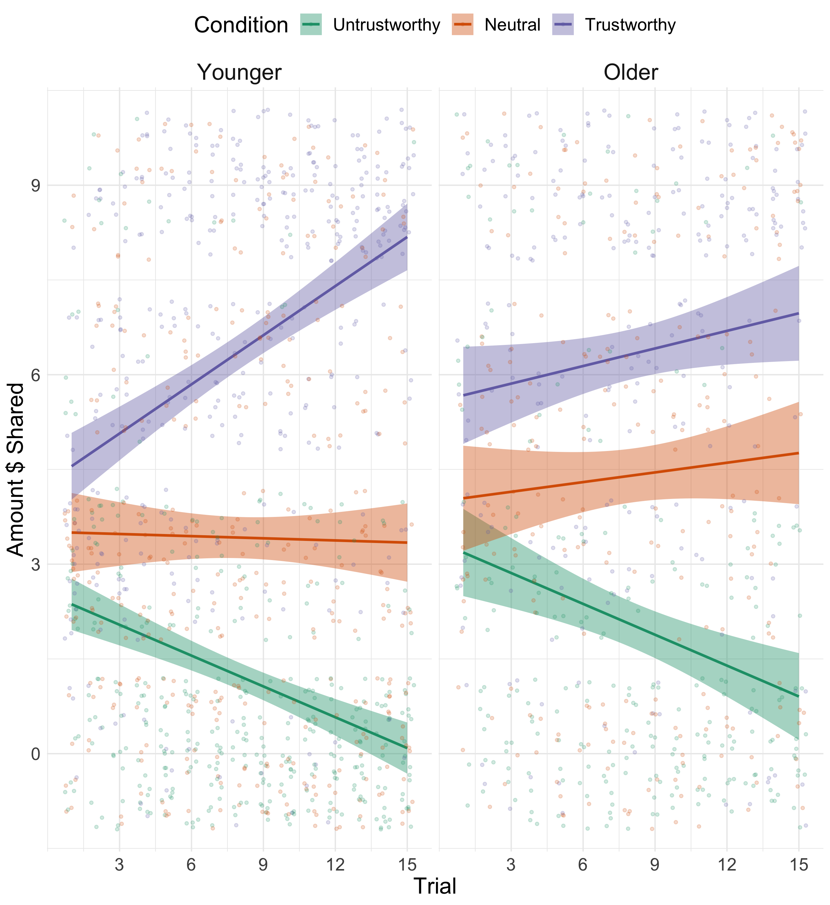
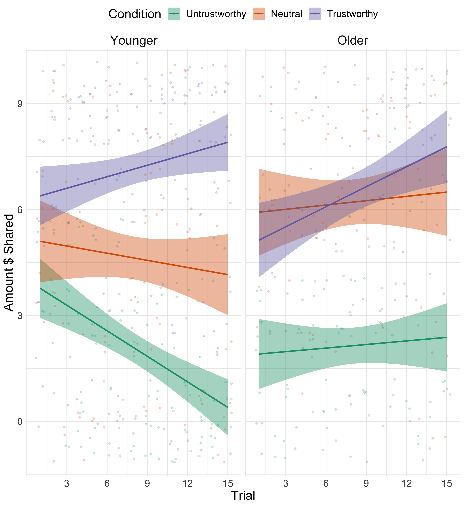
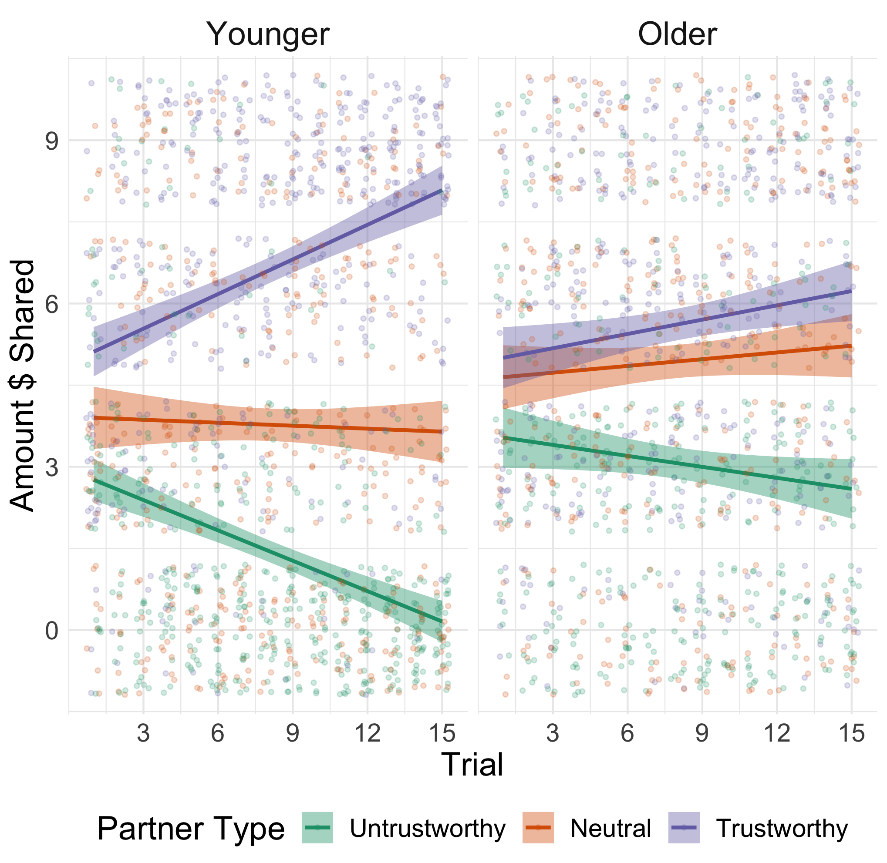
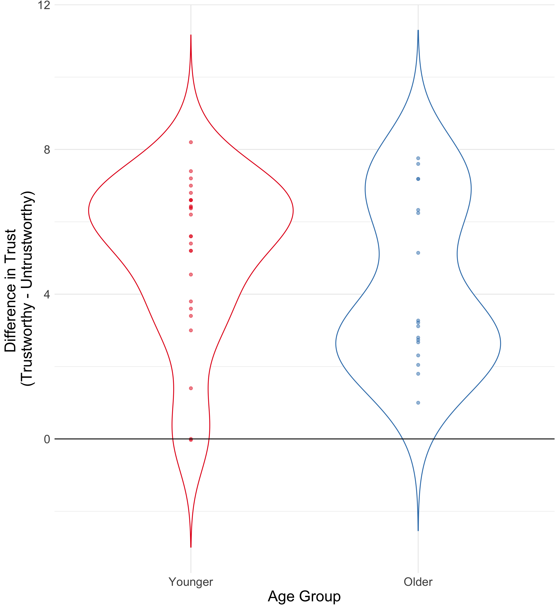
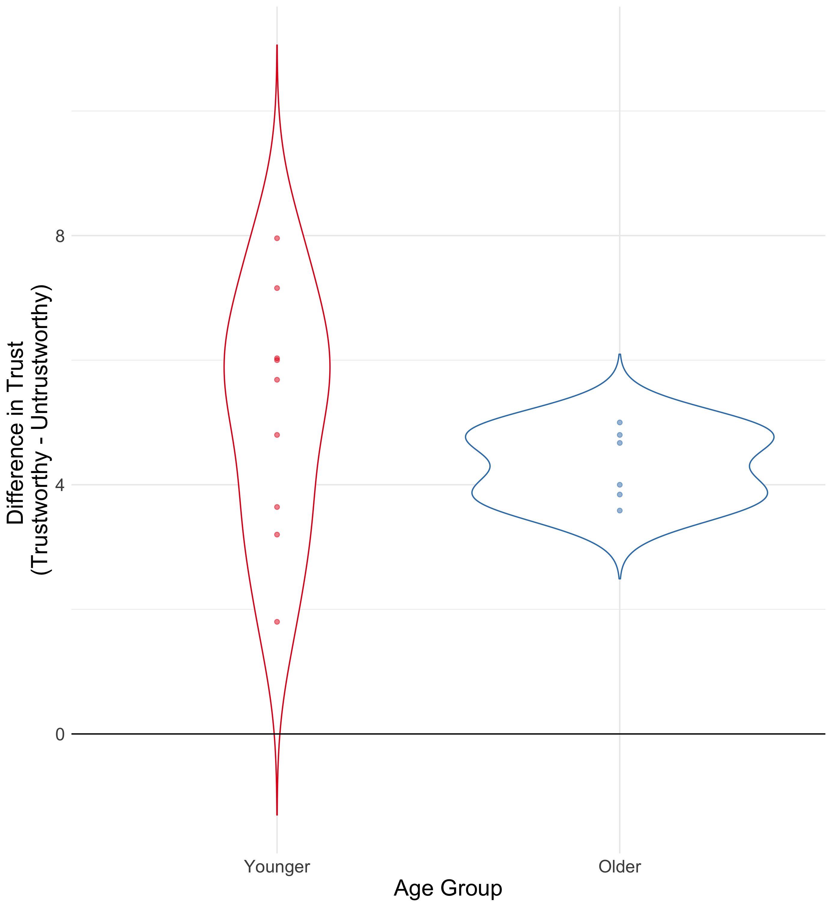
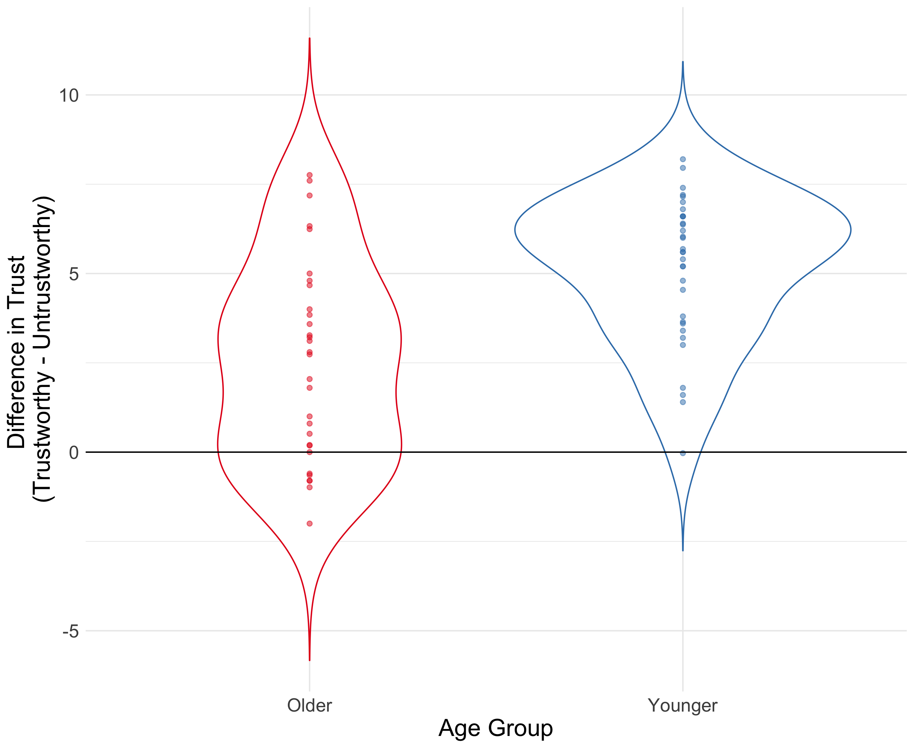

This is a quick and dirty analysis of the behavioral data by model fit group.

### Simple bar graph

{ width=33% } { width=33% } { width=33% }

### Change over time

{ width=33% } { width=33% } { width=33% }

### Trustworthy - Untrustworthy

{ width=33% } { width=33% } { width=33% }