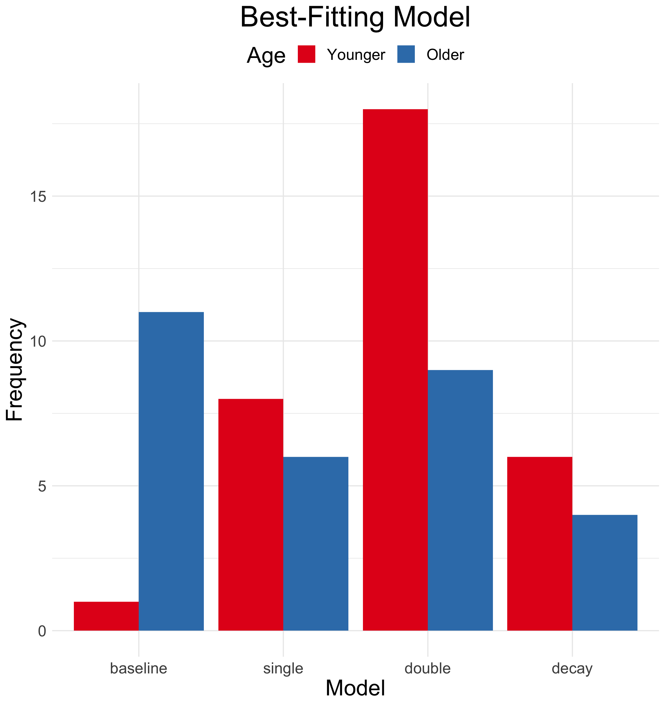
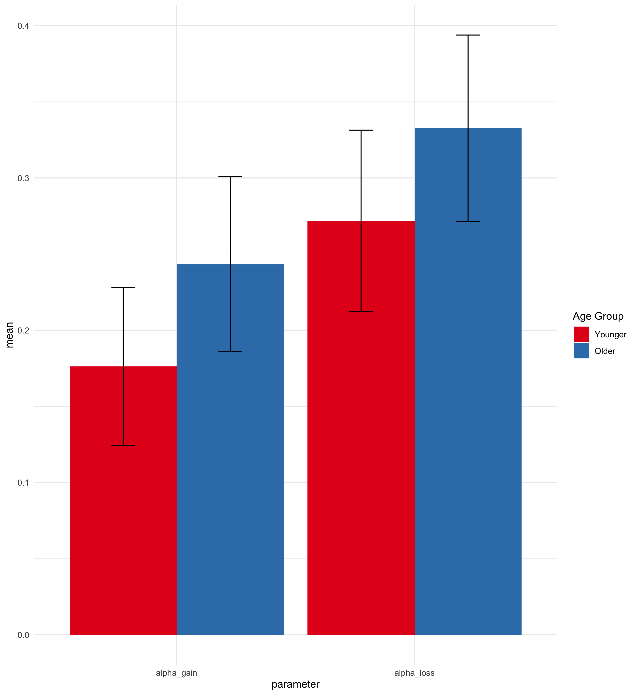
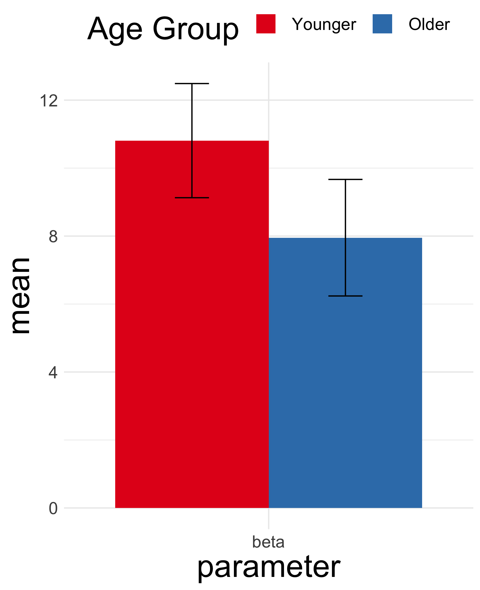
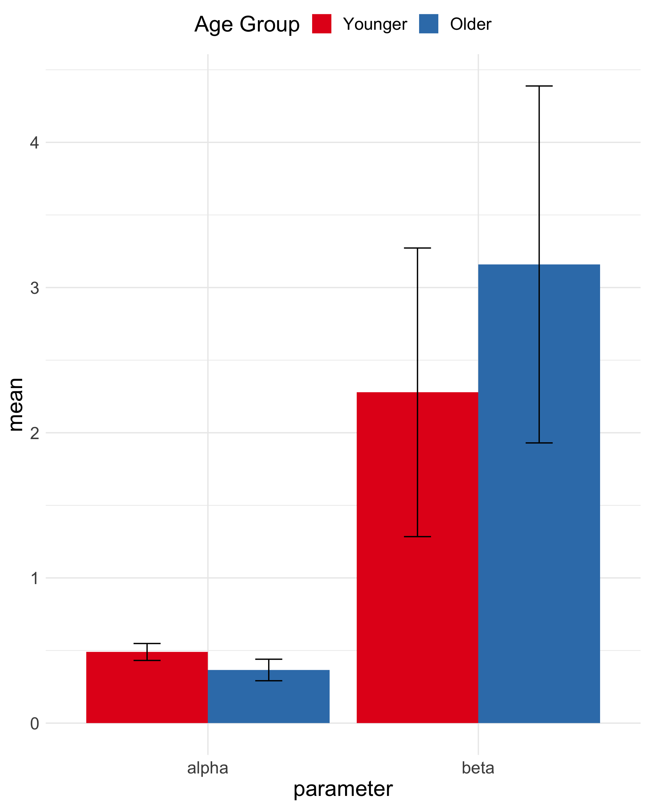

## Model Comparison


### The majority of participants were best fit by the double-alpha model, but _many_ older adults were not fit well by the model. Many were fit by the baseline (random) model.

## Two Alpha Model

### Vt+1(x) = Vt(x) + 
### αgain * max(𝛾 - (rt - Vt(x)), 0) + 
### αloss * min(𝛾 - (rt - Vt(x)) , 0)
### 𝛾 = 1 when partner shares, 0 when partner defects

```{r echo=FALSE, message=FALSE}
source('../06_model_parameters.R')
```
### Alphas


#### No age differences in either alpha, loss: _t_(`r round(a2loss$parameter)`) = `r round(a2loss$statistic,2)`, _p_ = `r round(a2loss$p.value,3)`; loss: _t_(`r round(a2loss$parameter)`) = `r round(a2loss$statistic,2)`, _p_ = `r round(a2loss$p.value,3)`

### Betas


#### No age differences in beta, _t_(`r round(a2beta$parameter)`) = `r round(a2beta$statistic,2)`, _p_ = `r round(a2beta$p.value,3)`

## One Alpha Model

### Vt+1(x) = Vt(x) + α * (rt - Vt(x))

```{r echo=FALSE, message=FALSE}
source('../06_model_parameters.R')
```
## Alphas


#### No age differences in  alpha, _t_(`r round(a1alpha$parameter)`) = `r round(a1alpha$statistic,2)`, _p_ = `r round(a1alpha$p.value,3)`, or beta, _t_(`r round(a1beta$parameter)`) = `r round(a1beta$statistic,2)`, _p_ = `r round(a1beta$p.value,3)`